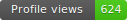
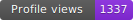
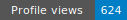

<div align="center">

# profile-counter

**Your own GitHub profile views counter. Free forever. Can't break.**

A drop-in replacement for [komarev.com/ghpvc](https://komarev.com) — except you own
the URL, you own the data, and there's no third-party service that can go down
on a random Tuesday.

[](https://vercel.com/new/clone?repository-url=https%3A%2F%2Fgithub.com%2Fothmarodev%2Fprofile-counter&env=UPSTASH_REDIS_REST_URL,UPSTASH_REDIS_REST_TOKEN&envDescription=Upstash%20Redis%20REST%20credentials%20%E2%80%94%20free%20tier%2C%20signup%20at%20console.upstash.com&envLink=https%3A%2F%2Fgithub.com%2Fothmarodev%2Fprofile-counter%23setup&project-name=profile-counter&repository-name=profile-counter)


<sub>Built by [@othmarodev](https://github.com/othmarodev) — [othmaro.dev](https://othmaro.dev)</sub>

</div>

---

## Why this exists

If your GitHub profile README has ever displayed a `Profile views: ?` broken
image — that's because the free third-party counter you were using went down.
Or got rate-limited. Or moved server. Or just disappeared.

It's not their fault. They're free services run by individuals, often hosted in
a single region, with no SLA. When they break, **your counter resets to zero**.
Your historical count — months or years of pride — is gone.

**profile-counter** is the same idea, but you own the deployment:

- Runs on **your** Vercel project (free tier, never charged)
- Stores count in **your** Upstash Redis (free tier, never charged)
- Exposes a URL you control: `your-project.vercel.app/api/views`
- Migrate from komarev/laobi by seeding the counter (no zero reset)
- 100% open source — fork it, audit it, modify the badge style, do whatever

If it ever breaks, it's because **you** broke it. And you can fix it.

## Live demo

[](https://counter.othmaro.dev/api/views?id=demo)

That badge above is rendered by **this exact code**, deployed to
[counter.othmaro.dev](https://counter.othmaro.dev). Every time you reload this
README, it counts up.

## Prerequisites

Before you start, make sure you have:

- A **GitHub account** (free) — [github.com](https://github.com/signup) if not
- A **Vercel account** (free) — sign up at [vercel.com/signup](https://vercel.com/signup) with your GitHub
- An **Upstash account** (free) — we'll create this in step 1
- **~10 minutes** of focus

**For the optional "migrate from komarev" step** (Step 4), you'll also need:

- [Node.js 18+](https://nodejs.org/) installed locally (check with `node --version` — if you see `v18` or higher, you're good)
- A terminal (Terminal.app on Mac, PowerShell on Windows, any shell on Linux)
- [Git](https://git-scm.com/downloads) (check with `git --version`)

If you skip the migration step, you don't need anything local — the whole setup happens in the Vercel and Upstash dashboards in your browser.

## Setup (~10 minutes total)

> **In a hurry?** Click the **Deploy with Vercel** button below, sign up to Upstash on the side, paste the two values from Upstash into Vercel when prompted. Done in 5 minutes. The walkthrough below has every click spelled out for first-timers.

### Step 1 — Create a free Upstash Redis (~2 minutes)

[Upstash](https://upstash.com) is a managed Redis service. Free tier gives you 10,000 commands/day — enough for ~5,000 profile visits per day, far more than any individual profile gets.

1. Go to **[console.upstash.com](https://console.upstash.com/)** and click **Sign Up**
2. Pick **"Continue with GitHub"** (no credit card asked, ever)
3. Once logged in, click **"Create Database"** (big button, top right)
4. Fill the form:
   - **Name**: `profile-counter` (or any name you like)
   - **Type**: `Regional` *(cheapest, free)*
   - **Region**: pick the one closest to where most of your readers are. `us-east-1` (N. Virginia) is a safe default — it's also Vercel's default region
   - **Eviction**: leave the default (`no eviction`)
5. Click **"Create"** at the bottom
6. The database opens. Look for the **"Connect"** section (or the **"REST API"** tab in older UIs). You'll see two values you need to copy:
   ```
   UPSTASH_REDIS_REST_URL="https://your-database-name.upstash.io"
   UPSTASH_REDIS_REST_TOKEN="AcXyAIjc...long-secret..."
   ```
7. **Click the eye icon** 👁 next to the token to reveal it. Copy **both lines** to a temporary note (TextEdit / Notes app / wherever).

   ⚠️ Treat the token like a password — never commit it, never paste it in chats, never put it in a public gist. We'll only paste it into Vercel in the next step.

**✅ What success looks like**: You have a temporary note open with both `UPSTASH_REDIS_REST_URL=...` and `UPSTASH_REDIS_REST_TOKEN=...`.

### Step 2 — Deploy to Vercel (~3 minutes)

Click the button. Vercel will clone this repo into your account and ask for the two values you just copied:

[](https://vercel.com/new/clone?repository-url=https%3A%2F%2Fgithub.com%2Fothmarodev%2Fprofile-counter&env=UPSTASH_REDIS_REST_URL,UPSTASH_REDIS_REST_TOKEN&envDescription=Upstash%20Redis%20REST%20credentials%20%E2%80%94%20free%20tier%2C%20signup%20at%20console.upstash.com&envLink=https%3A%2F%2Fgithub.com%2Fothmarodev%2Fprofile-counter%23setup&project-name=profile-counter&repository-name=profile-counter)

The button takes you through this flow:

1. **Create a Git repo** — Vercel will create `profile-counter` in your GitHub account. Click **"Create"**.
2. **Configure environment variables** — Vercel shows two empty fields:
   - `UPSTASH_REDIS_REST_URL` → paste your URL
   - `UPSTASH_REDIS_REST_TOKEN` → paste your token
3. Click **"Deploy"**. Vercel builds the project (~30 seconds), then takes you to the project dashboard.
4. **Disable deployment protection** (important — if you skip this, your badge will show "401 Unauthorized" to readers):
   - In the project dashboard, go to **Settings → Deployment Protection**
   - Find the section **"Vercel Authentication"** and turn the **"Require Log In"** toggle **OFF**
   - Click **Save** if asked

**✅ What success looks like**: Your project's dashboard shows a green "Ready" badge and a public URL like `https://profile-counter-yourname.vercel.app`.

<details>
<summary><b>Prefer the command line?</b> Click here for the CLI version.</summary>

```bash
# 1. Clone the repo
git clone https://github.com/othmarodev/profile-counter.git
cd profile-counter

# 2. Install the Vercel CLI (one-time, global)
npm install -g vercel

# 3. Log in
vercel login

# 4. Link / deploy
vercel
# Answer the prompts:
#   - Set up and deploy? Y
#   - Scope? (your username)
#   - Link to existing project? N
#   - Project name? profile-counter
#   - Code dir? ./
#   - Modify settings? N

# 5. Add env vars from your terminal (you'll paste each value into the prompt — never written to your shell history)
vercel env add UPSTASH_REDIS_REST_URL production
vercel env add UPSTASH_REDIS_REST_TOKEN production

# 6. Deploy to production
vercel --prod
```

Don't forget to disable Vercel Authentication in the project's Settings (Step 2.4 above) — the CLI doesn't toggle it for you.

</details>

### Step 3 — Verify your deployment (~1 minute)

Before you put the badge in your README, confirm the counter is working.

**Option A — In your browser**

Open this URL (replace `your-project` with the Vercel URL you got in step 2):

```
https://your-project.vercel.app/api/views?id=test
```

You should see a badge image like this in the browser:



Reload the page a few times. The number should **increase** each time. (It may take 1–2 seconds the first time as Vercel cold-starts.)

**Option B — With curl**

```bash
curl -i "https://your-project.vercel.app/api/views?id=test"
```

You want to see:

```
HTTP/2 200
content-type: image/svg+xml; charset=utf-8
...
<svg xmlns="http://www.w3.org/2000/svg" ... aria-label="Profile views: 1">
```

The `aria-label="Profile views: 1"` confirms storage works. Curl it again — should say `: 2`.

> **Seeing `HTTP/2 401` or "Authentication Required"?** You skipped step 2.4 — go back and turn off Vercel Authentication in Deployment Protection.

> **Seeing `aria-label="Profile views: ?"` with a `?`?** The env vars are missing or wrong. Go to your project → Settings → Environment Variables and double-check both values match what Upstash gave you. After fixing, click "Redeploy" on the latest deployment.

### Step 4 — Migrate your count from komarev *(optional, ~2 minutes)*

If you had a view count on komarev (or another service) you want to preserve, seed your new counter to that number. Otherwise skip — your counter starts at 1 on the next visit.

You need Node.js installed locally for this step.

```bash
# 1. Clone the repo (if you used the button in step 2, you can clone YOUR fork)
git clone https://github.com/YOUR_USERNAME/profile-counter.git
cd profile-counter

# 2. Install dependencies
npm install

# 3. Create a local .env from the template
cp .env.example .env

# 4. Edit .env with your Upstash credentials
#    On Mac/Linux:
nano .env
#    On Windows:
notepad .env
#    Paste the same UPSTASH_REDIS_REST_URL and UPSTASH_REDIS_REST_TOKEN
#    you used in Vercel. Save and close.

# 5. Seed the counter for your GitHub username
node scripts/seed.js --id=YOUR_USERNAME 623

# Output:
#   ✓ Seeded "profile-counter:YOUR_USERNAME" to 623
```

Replace `YOUR_USERNAME` and `623` with your values. The next time someone views your README, it'll show `624`.

> **Need more options?** Run `node scripts/seed.js --help` for the full command reference (read mode, multiple buckets, etc.).

> **Don't know your old count?** Check [Wayback Machine](https://web.archive.org/) for your profile — find a recent snapshot, read the number off the old badge. Or just pick a number that feels honest. It's *your* counter.

> **The `.env` file is gitignored** — it won't accidentally get committed if you push your fork.

### Step 5 — Add the badge to your profile README (~30 seconds)

Replace your old komarev/laobi badge with your new URL:

```markdown

```

Commit, push, then open your GitHub profile. The first load triggers GitHub's image proxy (camo) to cache the badge — give it ~30 seconds. Subsequent visits show the counter incrementing.

**✅ That's it. You own this counter forever.**

## Customization

All options are URL query parameters — no rebuild needed.

| Param | Default | Description |
|-------|---------|-------------|
| `id` | `default` | Bucket key. Use different ids to track different pages from one deployment (e.g., `?id=othmarodev`, `?id=my-project`). |
| `label` | `Profile views` | Text on the left side. URL-encode spaces. Max 40 chars. |
| `leftColor` | `#555` | Left background. Hex or named (`blue`, `red`, `blueviolet`, ...). |
| `rightColor` | `#4c1` | Right background. Same accepted formats. |
| `style` | `flat` | `flat` (shields.io-style with gradient) or `flat-square`. |

### Examples

```markdown
<!-- Default -->

```


```markdown
<!-- Custom label + blueviolet -->

```


```markdown
<!-- Brand colors (dark + orange) -->

```


```markdown
<!-- flat-square style -->

```


## Tracking multiple pages

Use distinct `id`s. Each id is an independent counter:

```markdown
<!-- Your GitHub profile -->


<!-- A project README -->


<!-- A blog post -->

```

All three count separately. One deployment, infinite buckets.

## How it works

```
┌──────────────────────┐    HTTPS    ┌──────────────────────┐
│ Reader's browser     │ ──────────▶ │ camo.githubusercontent│
│ loading your README  │             │   .com proxy          │
└──────────────────────┘             └─────────┬────────────┘
                                                │ on cache miss
                                                ▼
                                  ┌──────────────────────────┐
                                  │ your Vercel edge function│
                                  │      /api/views          │
                                  └─────────┬────────────────┘
                                            │ INCR
                                            ▼
                                  ┌──────────────────────────┐
                                  │      Upstash Redis       │
                                  │  profile-counter:{id}    │
                                  └──────────────────────────┘
```

- **Edge runtime** for low latency (Vercel routes the request to the closest
  region — usually 30-80ms for the increment + render).
- **Atomic INCR** so concurrent requests can't lose increments.
- **No GitHub API calls** — the counter is purely your storage.
- **camo cache** is the one thing you can't control — GitHub re-proxies the
  badge image only when the cache TTL expires (usually a few minutes), so the
  number you see is monotonically increasing but not "every-pageview-exact".
  This is the same limitation that komarev, hits.sh, visitor-badge.laobi.icu
  and every other counter on the planet has.

## Comparison

| | profile-counter | komarev.com | visitor-badge.laobi.icu | hits.sh |
|---|:---:|:---:|:---:|:---:|
| **You own the URL** | ✅ | ❌ | ❌ | ❌ |
| **You own the data** | ✅ | ❌ | ❌ | ❌ |
| **Can't be turned off by a third party** | ✅ | ❌ went down 2024, 2025, 2026 | ❌ | ❌ |
| **Migrate from komarev (seed initial count)** | ✅ | n/a | ❌ | ❌ |
| **Open source** | ✅ MIT | ❌ | ❌ | ❌ |
| **Multiple counters per deployment** | ✅ | ❌ | ❌ | ❌ |
| **Free** | ✅ Vercel + Upstash free tiers | ✅ | ✅ | ✅ |
| **Setup time** | 5 min | 0 min | 0 min | 0 min |

The trade-off is honest: free third-party services beat self-hosted on
"time to first badge". Self-hosted wins on **every** other axis.

## Troubleshooting

The eight most common issues people hit. Click to expand.

<details>
<summary><b>My badge shows "Authentication Required" / a 401 error</b></summary>

Vercel's "Deployment Protection" is on for your project. Disable it:

1. Open your project on [vercel.com](https://vercel.com) → **Settings → Deployment Protection**
2. Find **"Vercel Authentication"** and turn the **"Require Log In"** toggle **OFF**
3. Click **Save**
4. Reload your badge — it should work within a few seconds

</details>

<details>
<summary><b>My badge shows "Profile views: ?" (a literal question mark)</b></summary>

This means the Edge function ran but couldn't reach your Redis. Check:

1. Both `UPSTASH_REDIS_REST_URL` and `UPSTASH_REDIS_REST_TOKEN` are set in your Vercel project → **Settings → Environment Variables**
2. The values **match exactly** what Upstash shows in the database "Connect" tab (no extra spaces, no quotes around the values)
3. After fixing, go to **Deployments**, find the latest one, click the `...` menu → **Redeploy** (without rebuild is fine)

</details>

<details>
<summary><b>"vercel: command not found" when I try the CLI</b></summary>

The Vercel CLI isn't installed. Run:

```bash
npm install -g vercel
```

If you get `permission denied` on Mac/Linux, use:

```bash
sudo npm install -g vercel
```

Or use a Node version manager like `nvm` so you don't need sudo:
[github.com/nvm-sh/nvm](https://github.com/nvm-sh/nvm).

</details>

<details>
<summary><b>"node: command not found" / npm not installed</b></summary>

You don't have Node.js. You only need it for the optional **seed** step (Step 4). Install from [nodejs.org](https://nodejs.org/) — pick the LTS version. Verify after install:

```bash
node --version    # should print v18.x or higher
npm --version     # should print 9.x or higher
```

</details>

<details>
<summary><b>The counter doesn't increase when I reload my README</b></summary>

This is GitHub's image cache (camo), not a bug in the counter.

GitHub proxies external images through `camo.githubusercontent.com` and caches them for several minutes. Your function is incrementing, but camo serves you the same cached SVG until the TTL expires.

To verify the counter actually moves:

```bash
curl -s "https://your-project.vercel.app/api/views?id=YOUR_USERNAME" | grep aria-label
# Run this 3 times — the number should go up each time.
```

If `curl` shows the count moving but the badge in your README doesn't, that's camo cache — wait a few minutes.

</details>

<details>
<summary><b>I changed the env vars but the badge still shows old behavior</b></summary>

Vercel applies env var changes only to **new** deployments. After changing variables:

1. Go to **Deployments** in your project
2. Click the `...` menu on the latest deployment → **Redeploy**
3. (You can uncheck "Use existing build cache" for a totally clean rebuild, but it's usually not necessary)

Wait ~30 seconds for the new deployment to go live, then reload your badge.

</details>

<details>
<summary><b>The seed script says "Missing UPSTASH_REDIS_REST_URL..."</b></summary>

The local `.env` file isn't set up. Make sure you:

1. Are in the project root: `cd profile-counter`
2. Created the file: `cp .env.example .env`
3. Edited `.env` with your actual values (not the placeholders)
4. The two lines look like:
   ```
   UPSTASH_REDIS_REST_URL=https://your-database-name.upstash.io
   UPSTASH_REDIS_REST_TOKEN=AcXyAIjc...
   ```
5. **No surrounding quotes are needed** — the seed script handles both with and without

</details>

<details>
<summary><b>Upstash signup blocked / not available in my country</b></summary>

Upstash is available globally but a handful of countries are restricted by US export controls. Workarounds:

- Try [Vercel KV](https://vercel.com/docs/storage/vercel-kv) instead — same Redis API, same free tier
- Or use [Redis Cloud's free tier](https://redis.com/try-free/) (30 MB free, HTTP REST available with their REST proxy)
- Both swaps are ~2 lines in `api/views.js` — the function only uses `redis.incr(key)`

</details>

<details>
<summary><b>Still stuck? Open an issue</b></summary>

If your problem isn't here, [open an issue](https://github.com/othmarodev/profile-counter/issues/new) with:

- Your Vercel project URL
- The output of `curl -i "your-project.vercel.app/api/views?id=test"` (full HTTP response, including headers)
- Anything you tried already

I'll add the answer to this list so the next person finds it faster.

</details>

## FAQ

<details>
<summary><b>Why Vercel and not Cloudflare Workers?</b></summary>

Both work. Vercel was picked because most devs already have a Vercel account
and the **Deploy with Vercel** button gets you to a working counter in one
click. If you prefer Cloudflare, the Edge function adapts in ~20 lines — see
[Issue #1](https://github.com/othmarodev/profile-counter/issues) (PR welcome).

</details>

<details>
<summary><b>Why Upstash and not [other Redis]?</b></summary>

Upstash Redis is HTTP-based, which is required for Vercel Edge functions
(no TCP at the edge). Their free tier (10k commands/day) is generous and they
don't ask for a credit card. If you already use a different HTTP-callable KV
(Cloudflare KV, Redis Cloud HTTP API), swapping is one import change away.

</details>

<details>
<summary><b>Can I run this with no Redis (in-memory only)?</b></summary>

Vercel Edge functions are stateless — every invocation is a fresh isolate, so
in-memory state is lost between requests. You need *some* external storage.
Upstash is the lowest-friction option (free, no CC, no servers to manage), but
the storage call is one line so you can swap it for anything.

</details>

<details>
<summary><b>Is the count accurate?</b></summary>

It's accurate up to GitHub's camo image cache. GitHub re-proxies the badge
when its cache expires (usually a few minutes), and only THEN does our function
get called and increment the count. Two visits within camo's cache window
register as one increment.

This is the same limitation every counter has, including komarev. Counting
exact pageviews would require GitHub to embed something other than a cached
image, which isn't a thing.

</details>

<details>
<summary><b>Will this stay free?</b></summary>

Vercel Hobby plan: free, with 100k function invocations per month. A wildly
popular profile gets ~1,000 daily views = ~30k/month. You'd have to be in the
GitHub top-1000 to outgrow the free tier.

Upstash free: 10k commands/day. Each visit = 1 INCR = 1 command, so 10k daily
visits. Same story.

If you somehow exceed both: the paid tiers are cheap (~$1/month) or you can
swap to Cloudflare Workers (100k/day requests free).

</details>

<details>
<summary><b>Why is the badge always shown as `flat` style and not the GitHub-native one?</b></summary>

GitHub README image badges are static images — the platform doesn't have a
"native" badge concept. What you're used to seeing is the
[shields.io](https://shields.io) flat style, which is what we mimic in
`api/views.js`. The `flat-square` variant is also supported (`?style=flat-square`).

</details>

<details>
<summary><b>Can I use this for non-GitHub pages?</b></summary>

Yes. It's just an `` tag serving an SVG. Put it in your personal site, in
a blog post, in a project README hosted on GitLab, anywhere. Use different
`?id=` values to track separate pages.

</details>

## Contributing

PRs welcome. The codebase is intentionally tiny — under 300 lines of JS total.
Good first PRs:

- Cloudflare Workers adapter (`api/views.cloudflare.js`)
- Additional badge styles (`plastic`, `social`, `for-the-badge`)
- Storage adapters (Vercel KV, Redis Cloud, MongoDB Atlas, Postgres)
- A `top.txt` recipe for the [shields.io endpoint format](https://shields.io/endpoint),
  so users who prefer can route through shields.io for extra styles

## Roadmap

- [x] Edge function with Upstash Redis
- [x] `flat` and `flat-square` styles
- [x] Migration script from third-party counters
- [x] Multiple counters per deployment via `?id=`
- [ ] `for-the-badge` and `plastic` styles
- [ ] Cloudflare Workers adapter
- [ ] Privacy-friendly analytics endpoint (`/api/stats?id=...`, requires auth)
- [ ] Webhook on milestone counts (Discord/Slack)

## License

[MIT](./LICENSE) © 2026 [Othmaro Fallas Rojas](https://othmaro.dev)

If you deploy this and your counter works, consider a star — it's the
GitHub-native equivalent of the badge.
